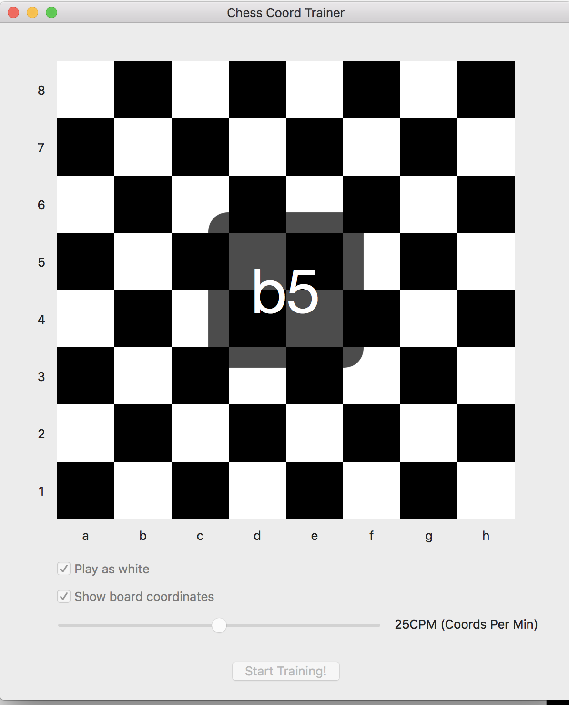

# ChessCoordTrainer

The game concept is very similar to the one in the chess.com app. The only difference is that you have to respond to the quizz in rythm, one beat is the question (for example g5) and one empty beat is your opportunity to respond by cliquing on a square. You have to set your tempo and start the game just like when a musician practices chord changes. Again the key is to force yourself to respond in rythm even if you think you don’t know where the right square is.

# Features wanted
- The beat mechanism is naive and should be improved
- The app is ugly
- The app needs to be on android and iOS because tapping is much more natural than clicking
- The app should show some kind of charts to prove that the user is learning 
- The app includes no explicit welcome slides or any kind of explanation on itself and is way too far from being self explanatory

**Pull request are welcome!**
